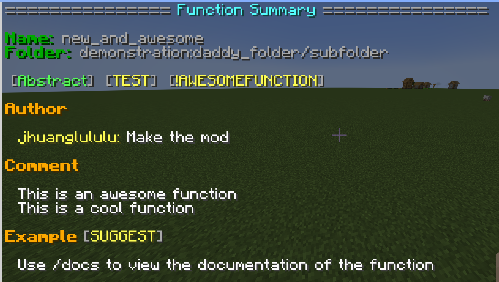

# Command Utils

**一個 1.21.4 的 Fabric 模組**
* .mcfunction 搜尋
* .mcfunction 註釋（docs/documentation)

**優點**
* 不用在記得所有的function在哪和如何使用
* 只需要安裝在伺服器 超適合多人協作
* 裝了你就是專家

## 備註
因為有使用到其他人的代碼 所以`github` 上不會放 .jar 載點 如果需要模組可以自己下載原始碼來安裝或是透過 `Discord` 聯繫 `jhuanglululu`

## 指令展示 (listfunction)
<h1>
  
</h1>


## 指令展示 (docs)
<h1>
  
</h1>

# 使用教學 (docs)
NOTE: 請至少會寫 `datapack`

## 1. 開頭 DOCS

為了讓模組區分一般的標記和註釋需要在整個 `mcfunction` 的第一行以 `# @DOCS` 開頭

NOTE: `#` 和 `@DOCS` 中間有一個空格
```mclang
# @Docs
# Other docs
# ...

your datapack code
...
```

非 `#` 開頭的第一行代表註釋結束

NOTE: `#` 後面需要跟一個空格

## 2. 屬性 Properties< >

在 `@Docs` 與 `@Tags` 後可以加入屬性來給標籤加入更多註釋

屬性是由 `屬性本身<額外內容>` 組成 不是所有屬性都會接收額外內容 但額外內容可以為某些特定的屬性增加解釋

NOTE: 不完整屬性列表在下面

使用方法
```mclang
# @Docs DEPRECATED<jhuanglululu:new_function> RECURSIVE IF
# 屬性會跟在標籤後面 距離一個空格
# 輸入值會緊貼著屬性並且用 < > 包圍
# 屬性與屬性之間距離一個空個
# 輸入值不是必須
# Other docs
# ...

your datapack code
...
```
自定義屬性
```mclang
# @Docs MYCUSTOMTAG<Some description about the tag>
# 無法識別的屬性都算是自定義標籤 後面輸入懸停顯示文字
# Other docs
# ...

your datapack code
...
```

## 3. 標籤 @Tag

跟 `@Docs` 所有標籤後面都可以接更多屬性 無法識別的標籤也會當作自定義標籤處理

在標籤下面還可以輸入額外內容

```mclang
# @Docs DEMO
# @Author
# jhuanglululu
# Handsome -> jhuanglululu
# 箭頭 " -> " 有神奇功能
# @EXAMPLE SUGGEST<提示！>
# ...

your datapack code
...
```

### 所有屬性的簡介以及他們的標籤（標籤其實可以用在任何屬性） ###

- Docs

        宣告註釋開頭的屬性

- Author

        作者標籤 讓大家知道你是誰

- Date

        日期標籤 記錄時間

- Comment

        註釋標籤 想寫啥就寫啥

- Example

        範例標籤 稍微介紹一下你辛苦寫的 function 吧

- Variable

        會用到的數值

- Require

        執行前要求

- Ensure

        確保某件事

- Update

        更新某個值

- Return

        回傳值

- Reference

        參考

- SeeAlso
        
        建議你去看看        

- Kpop

        讓我向你推銷一下我的老婆們


| @Docs 的屬性   | < 輸入值 >     | NOTE                                      |
|-------------|-------------|-------------------------------------------|
| ABSTRACT    |             | 摘要函式（？） 沒有寫東西的                            |
| ADVANCEMENT | advancement | 用於成就獎勵 輸入 advancement 點擊時獲得成就             |
| CLICKEVENT  |             | 用於 clickevent                             |
| DEPRECATED  | alternative | 棄置 輸入 alternative 點擊時獲得註釋                 |
| DEMO        |             | 示範用                                       |
| ELSE        | parent      | Else 分支 輸入 parent 來找到母函式                  |
| EXCEPTION   | exception   | 處理意外 輸入 exception 來顯示意外情境                 |
| IF          | parent      | If 分支 輸入 parent 來找到母函式                    | 
| IMPLEMENT   | abstract    | 實現（？） 寫完 Abstract 的函式 輸入 abstract 點擊時或的註釋 |
| INIT        |             | 初始化數值的函式                                  |
| LOAD        |             | /reload 後執行                               |
| MACRO       |             | macro 函式                                  |
| PRIVATE     |             | 不應該被外部使用                                  |
| RECURSIVE   |             | 遞迴函式（俄羅斯娃娃）                               |
| TEAM        | team        | 隊伍專屬 輸入來顯示隊伍名稱                            |
| TEMPLATE    |             | 模板                                        |
| TEST        |             | 測試用函式                                     |
| TICK        |             | 每個 tick 都會執行                              |   

| @Docs 的屬性  | < 輸入值 >    | NOTE                            |
|------------|------------|---------------------------------|
| LINK       | url        | 放連結                             |
| RUN        | function   | 點擊執行 function                   |
| SCOREBOARD | obj        | 使用到的 scoreborad 點擊顯示 scoreboard |
| SUGGEST    | suggestion | suggestion 放指令可以在點的時候推薦給玩家      |

模組可以聯絡 Discord `jhuanglululu` 獲取
